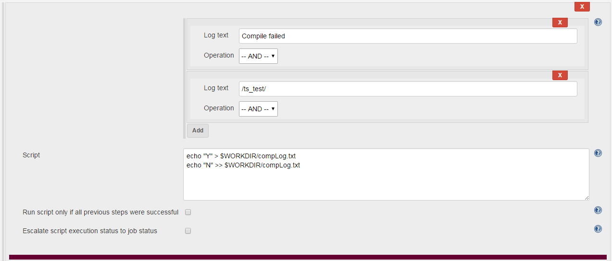
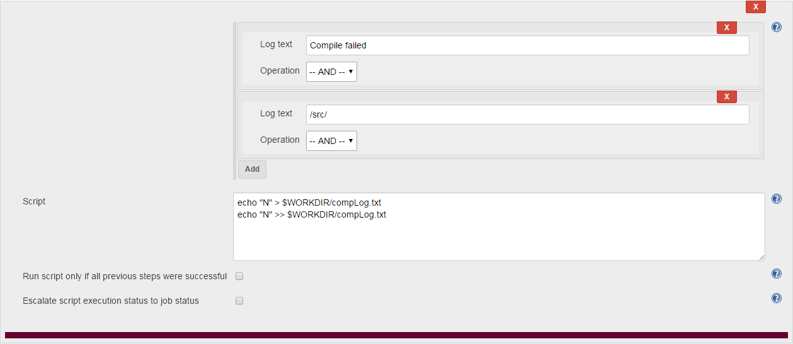
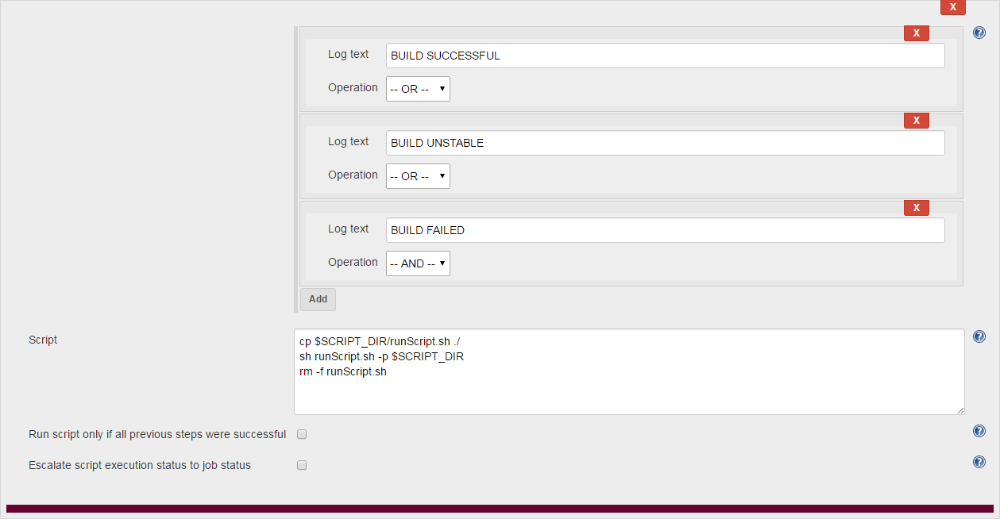

## Configuration for Jenkins

~~The option `Delete workspace before build starts` should be **unchecked**.  With it running, we are unable to get a reasonable time when Javadoc was last run.~~
 * Determining JavaDoc generation is not being tracked at this time
 * There are three addition post-build tasks that need to be added (pictures below) and the normal post-build task will have to be recreated as the last task (since it must execute last).

___

### Properties Content

Add `SCRIPT_DIR=[wherever you store the scraper scripts]` to to the `Properties Content` box under Build Environment.
Add `WORKDIR=$WORKSPACE/$PROJECT_NAME` to to the `Properties Content` box under Build Environment.

___

### Tasks

 * Task 1: Failure of TS_Test Compilation

`Compile failed` AND `/ts_test/` as log text options

`echo "Y" > $WORKDIR/compLog.txt`

`echo "N" >> $WORKDIR/compLog.txt`

   * Task 2: Failure of Student Source Code Compilation

`Compile failed` AND `/src/` as log text options

`echo "N" > $WORKDIR/compLog.txt`

`echo "N" >> $WORKDIR/compLog.txt`

   * Task 3: Failure of Student Test Compilation

`Compile failed` AND `/test/` as log text options

`echo "N" > $WORKDIR/compLog.txt`

`echo "N" >> $WORKDIR/compLog.txt`

   * Task 4: Running Scrapers

`BUILD SUCCESSFUL` OR `BUILD UNSTABLE` OR `BUILD FAILED` as log text options

`cp $SCRIPT_DIR/runScript.sh ./`    
`sh runScript.sh -p $SCRIPT_DIR`    
`rm -f runScript.sh`    

